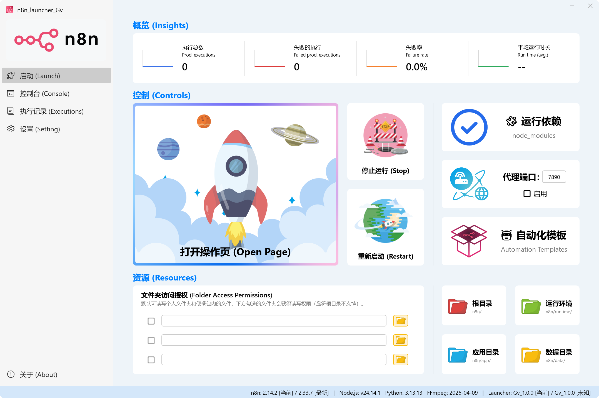

<div align="right">

**简体中文** · [English](./README.en.md)

</div>

# n8n 便携整合包 · n8n Portable Gv

> Windows 系统专用的 n8n 免安装整合包，解压即可使用。

[](./LICENSE)
[](https://dotnet.microsoft.com/download/dotnet/8.0)
[](https://github.com/Gil-ver/n8n_portable_Gv/releases)

```
n8n_portable_Gv/
├─ n8n_launcher_Gv.exe    图形化启动器
├─ README.txt             使用说明
├─ AGENTS.md              给 AI 助手的操作手册
├─ app/                   n8n 本体
├─ runtime/               Node.js · Python · FFmpeg
└─ data/                  你的工作流、凭据、执行历史
```

所有依赖都在这一个文件夹内，不写注册表，不装系统服务，数据不外溢。

---

## 为什么做这个

在 Windows 上安装使用 n8n 十分复杂，数据又分散。官方只提供 npm 和 Docker 两种安装方式，前者需要先装 Node.js，配好环境变量，再开命令行敲 `npx n8n`。装完之后各个组件是分开的：Node.js 在 Program Files，n8n 的数据在用户目录的 `.n8n` 下。换台电脑就得把整套流程重做一遍，已有的工作流和凭据也要手动找出来迁移。

所以我把这些都整理收录进了一个文件夹，解压即可使用，删掉文件夹相当于卸载干净。另外内置了 Python 和 FFmpeg，工作流可以直接调用脚本、处理音视频。启动器是专门来管理 n8n 的启停、配置和执行记录，不必再跟命令行打交道。

## 下载使用

到 [Releases](https://github.com/Gil-ver/n8n_portable_Gv/releases) 下载压缩包，然后：

1. 解压到任意位置（请避开系统目录，详见下方注意事项）
2. 双击 `n8n_launcher_Gv.exe`
3. 点击「开始运行」，浏览器会自动打开 n8n

无需安装，无需管理员权限。

## 包含哪些部件

| 部件 | 作用 |
|---|---|
| **n8n** | 工作流自动化本体 |
| **Node.js** | n8n 的运行时 |
| **Python** | 供工作流调用脚本，预装 yt-dlp、requests、browser-cookie3 |
| **FFmpeg** | 音视频处理 |
| **启动器** | 图形界面管理 n8n，本仓库开源的部分 |

各组件的版本、许可协议与源码获取途径见 [THIRD_PARTY_LICENSES.md](./THIRD_PARTY_LICENSES.md)。

## 让 AI 帮你搭建工作流

包内附带 `AGENTS.md`，是一份面向 AI 助手的操作手册。把它连同你的 n8n 地址和 API Key 交给 Claude Code、Cursor、Codex、Opencode，甚至 VS Code 中的 AI 插件，AI 就能通过 n8n REST API 直接创建和修改工作流。

## 启动器

<picture>
  <source media="(prefers-color-scheme: dark)" srcset="images/interface-dark.png">
  
</picture>

<sub>界面主题可跟随系统。上图会随你的 GitHub 配色自动切换浅色或深色版本。</sub>

|  |  |
|---|---|
| **一键启停** | 实时显示 n8n 运行状态 |
| **开机自启** | 随系统启动，自动拉起 n8n 并收进托盘 |
| **托盘常驻** | 关闭窗口不退出，托盘菜单直接启停与查看状态 |
| **低内存占用** | 收进托盘后自动降低内存占用，适合长期挂机 |
| **执行统计** | 直读 n8n 的 SQLite，成功 / 失败 / 耗时一目了然 |
| **执行记录** | 可按状态与工作流筛选 |
| **内嵌控制台** | n8n 输出直接在窗口内查看 |
| **文件白名单** | 图形化配置 `N8N_BLOCK_FILE_ACCESS_TO_N8N_FILES` 等 |
| **代理注入** | 需要走代理的场景一键配置 |
| **依赖修复** | `node_modules` 健康检查与自动修复 |
| **其他** | 时区设置、浏览器打开策略、Acrylic 毛玻璃 |

启动器是整合包里唯一原创的部分，以 MIT 协议开源，源码在本仓库的 `Launcher/` 目录下。

<details>
<summary><b>自己编译启动器</b></summary>

需要 Windows 10 1809+ (x64) 与 [.NET 8 SDK](https://dotnet.microsoft.com/download/dotnet/8.0)。

```bash
git clone https://github.com/Gil-ver/n8n_portable_Gv.git
cd n8n_portable_Gv/Launcher/n8n_Launcher_Gv
dotnet publish -c Release -o publish
```

产物为 `publish/n8n_launcher_Gv.exe`，自包含单文件，目标机器无需安装 .NET 运行时。`RuntimeIdentifier`、`SelfContained`、`PublishSingleFile`、`ReadyToRun` 等发布参数已写在 csproj 的 Release 配置里，命令行无需重复传递。

编译好的 exe 替换整合包根目录的 `n8n_launcher_Gv.exe` 即可生效。

> **单独编译的 exe 无法独立运行。** 启动器不包含 n8n，它会在自身所在目录寻找 `app/`、`runtime/`、`data/` 这些同级路径。只 clone 本仓库编译出 exe 双击，会因找不到上述目录而无法启动 n8n。
>
> **使用 Visual Studio 时**：打开 `n8n_launcher_Gv.slnx` 即可，但菜单里的「生成」(Build) 产出的是 `bin/Release/` 下的一组 dll，不是可分发的单文件 exe。要得到分发产物仍需执行上面的 `dotnet publish`。

</details>

<details>
<summary><b>启动器源码结构</b></summary>

```
Launcher/
├─ icon/                          共享图标资源（SVG 源 + PNG/ICO）
│  ├─ launch/                     启动页插画与动画素材
│  └─ make_ico.py                 多尺寸 ICO 生成脚本（7 种尺寸 / LANCZOS）
└─ n8n_Launcher_Gv/
   ├─ MainWindow.xaml(.cs)              主窗口：五个功能页全部在此
   ├─ MainWindow.GradientRing.cs        渐变圆环绘制
   ├─ MainWindow.LaunchTileAnimation.cs 启动页磁贴动画
   ├─ MainWindow.MemoryOptimization.cs  托盘期动画挂起与工作集修剪
   ├─ App.xaml(.cs)                     应用入口、主题资源字典
   ├─ *Art.xaml                         启动页矢量插画（火箭 / 行星 / 云 / 火焰）
   ├─ N8nExecutionStats*.cs             执行统计：SQLite 读取 + 缓存
   ├─ N8nExecutionListService.cs        执行记录列表
   ├─ TimezoneService.cs                时区枚举与搜索
   ├─ TrayPopupMenu.cs                  托盘菜单
   ├─ icon/                             项目内图标（logo / app_icon）
   └─ Assets/Fonts/                     内嵌思源黑体（海外中文兜底显示）
```

请保持 `Launcher/` 这一层目录结构。csproj 通过 `..\icon\` 引用上一级的 `Launcher/icon/`，层级打乱后编译会因找不到资源而失败。

</details>

<details>
<summary><b>技术栈</b></summary>

| 项 | 说明 |
|---|---|
| 框架 | .NET 8 / WPF（`net8.0-windows`） |
| UI 库 | [WPF-UI](https://github.com/lepoco/wpfui)（Fluent 风格 + 托盘） |
| 数据 | Microsoft.Data.Sqlite（读取 n8n 的 `database.sqlite`） |
| 发布 | 自包含单文件、win-x64、ReadyToRun |
| 内嵌字体 | 思源黑体 CN Regular / Bold（SIL OFL 1.1） |

两个非默认的取舍：关闭了单文件压缩（`EnableCompressionInSingleFile=false`），用更大的体积换更低的内存占用；内嵌思源黑体是为没有中文字体的海外 Windows 提供兜底显示，国内系统的字体回退会优先命中 Microsoft YaHei UI，不受影响。

</details>

## 注意事项

| 事项 | 说明 |
|---|---|
| **存放位置** | 请勿放入 `C:\Program Files\` 等系统目录，会触发管理员权限要求，破坏便携性 |
| **路径不能含分号** | `;` 是 PATH 的分隔符，路径中带分号会导致 Python 与 FFmpeg 无法定位 |
| **迁移前先删 `app/node_modules`** | 该目录层级很深，直接复制会超出 Windows 260 字符路径限制。到新位置后用启动器的「依赖修复」重建即可 |
| **备份只需 `data/`** | 工作流、凭据、执行历史都在这里，其余部分可随时从 Releases 重新下载 |
| **启动器位置固定** | `n8n_launcher_Gv.exe` 需放在整合包根目录，它按相对路径查找 `app/`、`runtime/`、`data/` |

完整使用须知见整合包内的 `README.txt`。

## 反馈

使用中遇到问题、发现 Bug，或者有功能建议，欢迎到 [Issues](https://github.com/Gil-ver/n8n_portable_Gv/issues) 提出。

附上这些信息会更好定位：

- 整合包版本（压缩包文件名，如 `2026.7`）与启动器版本（底栏左下角，如 `Gv_1.0.0`）
- Windows 版本（Win10 / Win11）
- 复现步骤，以及出问题时控制台的输出

不擅长描述技术细节也没关系，只写「我遇到了什么问题」就行，我会追问需要的信息。

n8n 本身的用法问题（节点怎么配、表达式怎么写）建议去 [n8n 官方社区](https://community.n8n.io) 提问，那边有很多专业的人。本仓库只处理整合包与启动器相关的问题。

## 许可

- **启动器源码**：[MIT](./LICENSE)，可自由使用、修改、再分发
- **内嵌思源黑体**：SIL OFL 1.1，再分发时请保留 `Assets/Fonts/LICENSE-OFL.txt`
- **第三方组件**：n8n、Node.js、Python、FFmpeg 不在本仓库内，各自许可见 [THIRD_PARTY_LICENSES.md](./THIRD_PARTY_LICENSES.md)

其中 n8n 采用 **Sustainable Use License**（fair-code，非 OSI 开源协议），限定仅可用于内部业务目的，不得转售或作为托管服务提供给第三方，使用时请留意。

本整合包为非商业性质，永久免费，不转售，也不以托管服务形式提供 n8n。

## 致谢

[n8n](https://n8n.io) · [Node.js](https://nodejs.org) · [Python](https://www.python.org) · [FFmpeg](https://ffmpeg.org) · [WPF-UI](https://github.com/lepoco/wpfui) · [Source Han Sans](https://github.com/adobe-fonts/source-han-sans)
